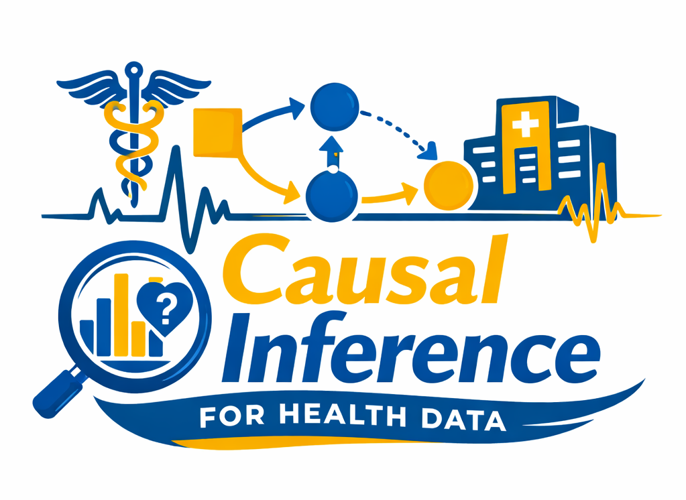

<table>
<tr>
<td width="100">
  
</td>
<td>
  <h2>Causal Inference for Health Data (CIHD)</h2>
</td>
</tr>
</table>

This course is organized around a sequence of hands-on vignettes.
Each vignette illustrates a *distinct causal concept*, using realistic
health datasets (primarily ICU data), and emphasizes **identification,
assumptions, and interpretation**, rather than black-box modeling.

---

### Vignette Overview

| # | Title | Core question | Data used |
|---|------|---------------|-----------|
| I | **Causal Effect Estimation** | How to estimate total effects in practice? | **MIMIC-IV**: BMI, mortality, Charlson comorbidities, age, sex, SOFA score. |
| II | **Heterogeneity in Oxygen Therapy in ICU** | How does the effect of oxygen therapy on PaO₂ vary across patients? How do TE and ETT differ? | **MIMIC-IV** time-series ICU data (0–48h): PaO₂, oxygen therapy, vitals, SOFA, age, sex. |
| III | **Hospitality Mortality after ICU Admission** | How much of the race disparity in ICU mortality is direct vs mediated vs confounded? | **MIMIC-IV**: demographics, SOFA, Charlson, labs, diagnosis, mortality; analyzed via `faircause`. |
| IV | **Causal Inference using m-graphs** | When do complete-case analysis and MICE fail? When is recovery possible? | Synthetic simulations + **VAHCS** longitudinal observational study. |
| V | **Obesity Paradox Measurement Error** | Can the obesity paradox be explained by differential measurement error? | **MIMIC-IV**: BMI, mortality, Elixhauser comorbidities, age; sensitivity analysis via `binsensate`. |
| VI | **Opioids Effect on Delirium in ICU** | How does text-derived baseline vulnerability change the estimated effect of opioids on delirium? | **MIMIC (III)**: structured ICU exposures (0–48h) + clinical notes (0–7d); keyword filtering + LLM annotation + IPW. |

---

<!--

## How to Read These Vignettes

Each vignette follows a common structure:

1. **Clinical question & causal target**
2. **Explicit definition of** \(X, Y, Z, W\)
3. **Data construction choices** (time windows, aggregation)
4. **Identification strategy**
5. **Estimation**
6. **Interpretation and failure modes**

Later vignettes intentionally *reuse earlier ideas* (e.g. IPW, heterogeneity,
measurement error), but in increasingly realistic and messy settings.

---

## Notes for Instructors

- Vignettes II–VI are fully reproducible (given data access).
- Vignette VI is modular: keyword filtering → Python LLM annotation → causal analysis.
- Several vignettes are designed to provoke *conceptual discomfort* rather than clean answers.

---

*CIHD — Causal thinking first, models second.* -->